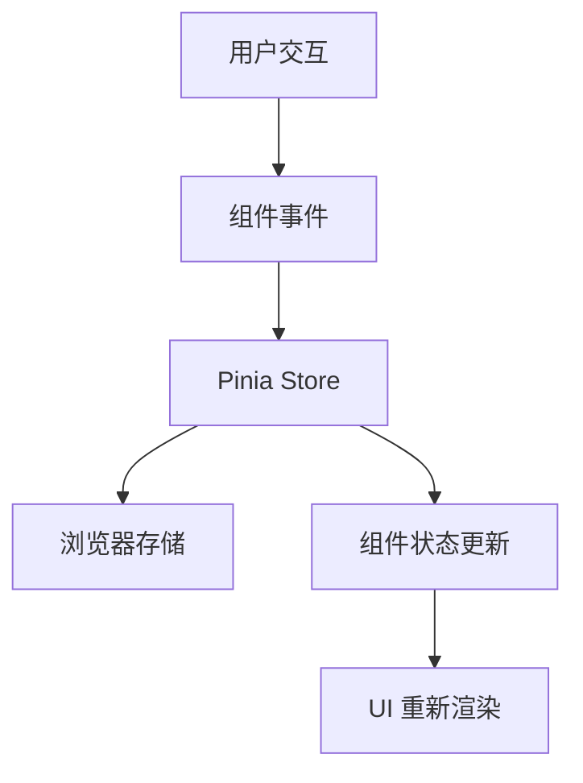

# 第一章：项目概述

## 🎯 项目目标

AI Sider Nav 是一个现代化的浏览器扩展，旨在替换默认的新标签页，提供更美观、更实用的用户体验。

### 核心功能

1. **美观的界面设计**
   - 自然风景渐变背景
   - 现代化的 UI 设计
   - 流畅的动画效果

2. **实时时间显示**
   - 大字体时间显示
   - 中文日期格式
   - 支持多种时间格式

3. **智能搜索功能**
   - 多搜索引擎支持
   - 搜索历史记录
   - 快捷搜索体验

4. **响应式设计**
   - 适配多种设备
   - 优化用户体验
   - 无障碍访问支持

## 🛠️ 技术选型

### 前端框架选择

**Vue 3 + TypeScript**
- ✅ 现代化的响应式框架
- ✅ 优秀的 TypeScript 支持
- ✅ Composition API 提供更好的代码组织
- ✅ 丰富的生态系统

**为什么选择 Vue 3？**
```typescript
// Vue 3 Composition API 示例
import { ref, computed, onMounted } from 'vue'

export default {
  setup() {
    const count = ref(0)
    const doubleCount = computed(() => count.value * 2)
    
    onMounted(() => {
      console.log('组件已挂载')
    })
    
    return { count, doubleCount }
  }
}
```

### 构建工具选择

**Vite**
- ⚡ 极快的开发服务器启动
- 🔥 热模块替换 (HMR)
- 📦 优化的生产构建
- 🔧 丰富的插件生态

**Vite vs Webpack 对比**
| 特性 | Vite | Webpack |
|------|------|---------|
| 启动速度 | 极快 | 较慢 |
| HMR | 毫秒级 | 秒级 |
| 配置复杂度 | 简单 | 复杂 |
| 生态成熟度 | 新兴 | 成熟 |

### 样式解决方案

**UnoCSS**
- 🎨 原子化 CSS 框架
- ⚡ 按需生成，体积小
- 🔧 高度可配置
- 🎯 零运行时

**UnoCSS 示例**
```html
<!-- 传统 CSS -->
<div class="button">点击我</div>
<style>
.button {
  background-color: #3b82f6;
  color: white;
  padding: 0.5rem 1rem;
  border-radius: 0.375rem;
}
</style>

<!-- UnoCSS -->
<div class="bg-blue-500 text-white px-4 py-2 rounded">点击我</div>
```

### 状态管理

**Pinia**
- 🍍 Vue 3 官方推荐
- 📝 优秀的 TypeScript 支持
- 🔧 简单易用的 API
- 🛠️ 强大的开发工具

**Pinia vs Vuex 对比**
```typescript
// Vuex (旧)
const store = new Vuex.Store({
  state: { count: 0 },
  mutations: {
    increment(state) { state.count++ }
  }
})

// Pinia (新)
export const useCounterStore = defineStore('counter', () => {
  const count = ref(0)
  const increment = () => count.value++
  return { count, increment }
})
```

## 🏗️ 项目架构

### 目录结构设计

```
AI-Sider-Nav/
├── public/                 # 静态资源
│   ├── manifest.json      # 扩展配置
│   ├── popup.html         # 弹出页面
│   └── icons/             # 图标资源
├── src/
│   ├── components/        # Vue 组件
│   │   ├── TimeDisplay.vue
│   │   └── SearchBox.vue
│   ├── stores/           # Pinia 状态管理
│   │   ├── app.ts
│   │   ├── settings.ts
│   │   └── index.ts
│   ├── styles/           # 样式文件
│   │   └── global.css
│   ├── App.vue           # 根组件
│   └── main.ts           # 应用入口
├── docs/                 # 项目文档
├── dist/                 # 构建输出
├── uno.config.ts         # UnoCSS 配置
├── vite.config.ts        # Vite 配置
├── tsconfig.json         # TypeScript 配置
└── package.json          # 项目配置
```

### 组件设计原则

1. **单一职责原则**
   - 每个组件只负责一个功能
   - 便于维护和测试

2. **可复用性**
   - 组件设计考虑复用场景
   - 通过 props 和 slots 提供灵活性

3. **响应式设计**
   - 组件适配不同屏幕尺寸
   - 使用相对单位和媒体查询

### 数据流设计



## 🎨 设计理念

### 视觉设计

1. **色彩方案**
   - 主色调：青绿色 (#79b4a6)
   - 辅助色：蓝绿渐变
   - 文字：白色，带阴影效果

2. **布局设计**
   - 居中对齐的主要内容
   - 合理的间距和比例
   - 清晰的视觉层次

3. **动画效果**
   - 页面加载动画
   - 交互反馈动画
   - 背景渐变动画

### 用户体验

1. **性能优先**
   - 快速加载
   - 流畅交互
   - 低内存占用

2. **易用性**
   - 直观的界面
   - 简单的操作
   - 清晰的反馈

3. **可访问性**
   - 键盘导航支持
   - 屏幕阅读器友好
   - 高对比度支持

## 🔍 技术难点分析

### 1. 浏览器扩展开发

**挑战**：
- Manifest V3 新标准
- 安全策略限制
- 跨浏览器兼容性

**解决方案**：
- 深入学习 Manifest V3 规范
- 使用标准 Web API
- 充分测试不同浏览器

### 2. 构建配置优化

**挑战**：
- 扩展特殊的构建需求
- 静态资源处理
- 代码分割策略

**解决方案**：
- 自定义 Vite 配置
- 合理的资源组织
- 按需加载优化

### 3. 样式框架集成

**挑战**：
- UnoCSS 配置复杂
- 避免样式冲突
- 性能优化

**解决方案**：
- 详细的配置文档
- 作用域样式隔离
- 按需生成样式

## 📈 项目价值

### 学习价值

1. **现代前端技术栈**
   - Vue 3 + TypeScript 最佳实践
   - 现代构建工具使用
   - 原子化 CSS 应用

2. **浏览器扩展开发**
   - Manifest V3 标准
   - 扩展 API 使用
   - 跨浏览器兼容

3. **工程化实践**
   - 代码规范和质量
   - 性能优化技巧
   - 项目管理方法

### 实用价值

1. **提升开发效率**
   - 可复用的组件库
   - 完整的工程化配置
   - 详细的文档说明

2. **用户体验优化**
   - 美观的界面设计
   - 流畅的交互体验
   - 个性化的功能设置

## 🎓 学习建议

### 前置知识

1. **基础技能**
   - HTML/CSS/JavaScript
   - ES6+ 语法特性
   - 模块化开发

2. **框架知识**
   - Vue 3 基础概念
   - TypeScript 基础语法
   - 组件化开发思想

3. **工具链**
   - Node.js 和 npm/pnpm
   - 版本控制 Git
   - 代码编辑器使用

### 学习路径

1. **理论学习**
   - 阅读官方文档
   - 理解核心概念
   - 掌握最佳实践

2. **实践操作**
   - 跟随教程编码
   - 独立完成练习
   - 解决实际问题

3. **深入探索**
   - 阅读源码实现
   - 参与开源项目
   - 分享学习心得

## 🔗 相关资源

### 官方文档
- [Vue 3 官方文档](https://vuejs.org/)
- [Vite 官方文档](https://vitejs.dev/)
- [UnoCSS 官方文档](https://unocss.dev/)
- [Pinia 官方文档](https://pinia.vuejs.org/)

### 扩展开发
- [Chrome Extensions 文档](https://developer.chrome.com/docs/extensions/)
- [Edge Extensions 文档](https://docs.microsoft.com/en-us/microsoft-edge/extensions-chromium/)

### 学习资源
- [Vue 3 深入指南](https://vue3js.cn/)
- [TypeScript 入门教程](https://ts.xcatliu.com/)
- [现代前端工程化](https://github.com/woai3c/introduction-to-front-end-engineering)

---

**下一章：[环境搭建](./02-environment-setup.md)**
