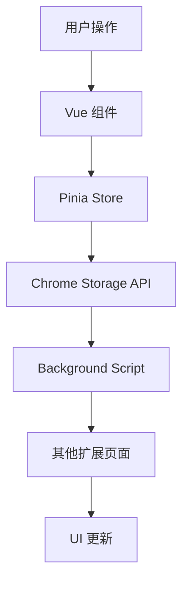

# 第十一章：浏览器扩展集成

## 🎯 学习目标

- 深入理解浏览器扩展架构
- 实现扩展与 Vue 应用的集成
- 掌握浏览器 API 的使用
- 优化扩展性能和用户体验

## 🏗️ 扩展架构设计

### 扩展组件架构

```
浏览器扩展架构
├── New Tab Page (主应用)
│   ├── Vue 3 应用
│   ├── 时间显示组件
│   ├── 搜索组件
│   └── 设置管理
├── Popup Page (弹出窗口)
│   ├── 快速设置
│   ├── 搜索引擎切换
│   └── 主题选择
├── Background Script (后台脚本)
│   ├── 数据同步
│   ├── 设置管理
│   └── 事件监听
└── Content Scripts (内容脚本)
    ├── 页面增强
    └── 数据收集
```

### 数据流设计



## 🔧 Chrome Storage API 集成

### 存储策略设计

```typescript
// src/utils/storage.ts
export interface StorageAdapter {
  get<T>(key: string): Promise<T | null>
  set<T>(key: string, value: T): Promise<void>
  remove(key: string): Promise<void>
  clear(): Promise<void>
}

export class ChromeStorageAdapter implements StorageAdapter {
  constructor(private area: 'sync' | 'local' = 'sync') {}

  async get<T>(key: string): Promise<T | null> {
    try {
      if (typeof chrome !== 'undefined' && chrome.storage) {
        const result = await chrome.storage[this.area].get(key)
        return result[key] || null
      }
      
      // 开发环境回退到 localStorage
      const stored = localStorage.getItem(key)
      return stored ? JSON.parse(stored) : null
    } catch (error) {
      console.error(`Failed to get ${key} from storage:`, error)
      return null
    }
  }

  async set<T>(key: string, value: T): Promise<void> {
    try {
      if (typeof chrome !== 'undefined' && chrome.storage) {
        await chrome.storage[this.area].set({ [key]: value })
      } else {
        // 开发环境回退到 localStorage
        localStorage.setItem(key, JSON.stringify(value))
      }
    } catch (error) {
      console.error(`Failed to set ${key} in storage:`, error)
    }
  }

  async remove(key: string): Promise<void> {
    try {
      if (typeof chrome !== 'undefined' && chrome.storage) {
        await chrome.storage[this.area].remove(key)
      } else {
        localStorage.removeItem(key)
      }
    } catch (error) {
      console.error(`Failed to remove ${key} from storage:`, error)
    }
  }

  async clear(): Promise<void> {
    try {
      if (typeof chrome !== 'undefined' && chrome.storage) {
        await chrome.storage[this.area].clear()
      } else {
        localStorage.clear()
      }
    } catch (error) {
      console.error('Failed to clear storage:', error)
    }
  }
}

// 创建存储实例
export const syncStorage = new ChromeStorageAdapter('sync')
export const localStorage = new ChromeStorageAdapter('local')
```

### Pinia 存储集成

```typescript
// src/stores/settings.ts - 更新版本
import { defineStore } from 'pinia'
import { ref, computed } from 'vue'
import { syncStorage } from '@/utils/storage'

export const useSettingsStore = defineStore('settings', () => {
  const settings = ref<UserSettings>({ ...defaultSettings })
  const isLoading = ref(false)
  const lastSyncTime = ref<Date | null>(null)

  // 从存储加载设置
  const loadSettings = async () => {
    isLoading.value = true
    try {
      const stored = await syncStorage.get<UserSettings>('userSettings')
      if (stored) {
        settings.value = { ...defaultSettings, ...stored }
        lastSyncTime.value = new Date()
      }
    } catch (error) {
      console.error('Failed to load settings:', error)
    } finally {
      isLoading.value = false
    }
  }

  // 保存设置到存储
  const saveSettings = async () => {
    try {
      await syncStorage.set('userSettings', settings.value)
      lastSyncTime.value = new Date()
    } catch (error) {
      console.error('Failed to save settings:', error)
      throw error
    }
  }

  // 监听存储变化
  const setupStorageListener = () => {
    if (typeof chrome !== 'undefined' && chrome.storage) {
      chrome.storage.onChanged.addListener((changes, areaName) => {
        if (areaName === 'sync' && changes.userSettings) {
          const newSettings = changes.userSettings.newValue
          if (newSettings) {
            settings.value = { ...defaultSettings, ...newSettings }
          }
        }
      })
    }
  }

  return {
    settings,
    isLoading,
    lastSyncTime,
    loadSettings,
    saveSettings,
    setupStorageListener,
    // ... 其他方法
  }
})
```

## 🎪 弹出窗口实现

### 增强版 popup.html

```html
<!DOCTYPE html>
<html lang="zh-CN">
<head>
  <meta charset="UTF-8">
  <meta name="viewport" content="width=device-width, initial-scale=1.0">
  <title>AI Sider Nav Settings</title>
  <link rel="stylesheet" href="popup.css">
</head>
<body>
  <div id="popup-app">
    <header class="popup-header">
      <h1>AI Sider Nav</h1>
      <button id="openFullSettings" class="icon-button" title="打开完整设置">
        <svg width="16" height="16" viewBox="0 0 24 24" fill="currentColor">
          <path d="M12 2C6.48 2 2 6.48 2 12s4.48 10 10 10 10-4.48 10-10S17.52 2 12 2zm-2 15l-5-5 1.41-1.41L10 14.17l7.59-7.59L19 8l-9 9z"/>
        </svg>
      </button>
    </header>

    <main class="popup-content">
      <div class="setting-group">
        <label class="setting-label">搜索引擎</label>
        <select id="searchEngine" class="setting-select">
          <option value="google">Google</option>
          <option value="bing">Bing</option>
          <option value="baidu">百度</option>
        </select>
      </div>

      <div class="setting-group">
        <label class="setting-label">时间格式</label>
        <div class="toggle-group">
          <button id="timeFormat24" class="toggle-button active">24小时</button>
          <button id="timeFormat12" class="toggle-button">12小时</button>
        </div>
      </div>

      <div class="setting-group">
        <label class="setting-label">显示秒数</label>
        <label class="switch">
          <input type="checkbox" id="showSeconds">
          <span class="slider"></span>
        </label>
      </div>

      <div class="setting-group">
        <label class="setting-label">语言</label>
        <select id="language" class="setting-select">
          <option value="zh-CN">中文</option>
          <option value="en-US">English</option>
        </select>
      </div>
    </main>

    <footer class="popup-footer">
      <div class="sync-status" id="syncStatus">
        <span class="sync-indicator"></span>
        <span class="sync-text">设置已同步</span>
      </div>
    </footer>
  </div>

  <script src="popup.js"></script>
</body>
</html>
```

### popup.css 样式

```css
/* popup.css */
* {
  margin: 0;
  padding: 0;
  box-sizing: border-box;
}

body {
  width: 320px;
  font-family: -apple-system, BlinkMacSystemFont, 'Segoe UI', Roboto, sans-serif;
  background: linear-gradient(135deg, #79b4a6 0%, #6ba3a0 100%);
  color: white;
}

.popup-header {
  display: flex;
  align-items: center;
  justify-content: space-between;
  padding: 1rem;
  border-bottom: 1px solid rgba(255, 255, 255, 0.1);
}

.popup-header h1 {
  font-size: 1.125rem;
  font-weight: 600;
}

.icon-button {
  background: none;
  border: none;
  color: white;
  cursor: pointer;
  padding: 0.25rem;
  border-radius: 0.25rem;
  transition: background-color 0.2s;
}

.icon-button:hover {
  background: rgba(255, 255, 255, 0.1);
}

.popup-content {
  padding: 1rem;
}

.setting-group {
  margin-bottom: 1rem;
}

.setting-label {
  display: block;
  margin-bottom: 0.5rem;
  font-size: 0.875rem;
  font-weight: 500;
}

.setting-select {
  width: 100%;
  padding: 0.5rem;
  border: none;
  border-radius: 0.375rem;
  background: rgba(255, 255, 255, 0.9);
  font-size: 0.875rem;
  color: #374151;
}

.toggle-group {
  display: flex;
  background: rgba(255, 255, 255, 0.1);
  border-radius: 0.375rem;
  padding: 0.125rem;
}

.toggle-button {
  flex: 1;
  padding: 0.5rem;
  border: none;
  background: none;
  color: white;
  font-size: 0.875rem;
  border-radius: 0.25rem;
  cursor: pointer;
  transition: background-color 0.2s;
}

.toggle-button.active {
  background: rgba(255, 255, 255, 0.2);
}

.switch {
  position: relative;
  display: inline-block;
  width: 44px;
  height: 24px;
}

.switch input {
  opacity: 0;
  width: 0;
  height: 0;
}

.slider {
  position: absolute;
  cursor: pointer;
  top: 0;
  left: 0;
  right: 0;
  bottom: 0;
  background-color: rgba(255, 255, 255, 0.3);
  transition: 0.3s;
  border-radius: 24px;
}

.slider:before {
  position: absolute;
  content: "";
  height: 18px;
  width: 18px;
  left: 3px;
  bottom: 3px;
  background-color: white;
  transition: 0.3s;
  border-radius: 50%;
}

input:checked + .slider {
  background-color: rgba(255, 255, 255, 0.5);
}

input:checked + .slider:before {
  transform: translateX(20px);
}

.popup-footer {
  padding: 0.75rem 1rem;
  border-top: 1px solid rgba(255, 255, 255, 0.1);
}

.sync-status {
  display: flex;
  align-items: center;
  font-size: 0.75rem;
  opacity: 0.8;
}

.sync-indicator {
  width: 8px;
  height: 8px;
  border-radius: 50%;
  background: #10b981;
  margin-right: 0.5rem;
}

.sync-indicator.syncing {
  background: #f59e0b;
  animation: pulse 1s infinite;
}

@keyframes pulse {
  0%, 100% { opacity: 1; }
  50% { opacity: 0.5; }
}
```

### popup.js 逻辑

```javascript
// popup.js
class PopupManager {
  constructor() {
    this.elements = {
      searchEngine: document.getElementById('searchEngine'),
      timeFormat24: document.getElementById('timeFormat24'),
      timeFormat12: document.getElementById('timeFormat12'),
      showSeconds: document.getElementById('showSeconds'),
      language: document.getElementById('language'),
      syncStatus: document.getElementById('syncStatus'),
      openFullSettings: document.getElementById('openFullSettings')
    }
    
    this.init()
  }

  async init() {
    await this.loadSettings()
    this.bindEvents()
    this.setupStorageListener()
  }

  async loadSettings() {
    try {
      const result = await chrome.storage.sync.get('userSettings')
      const settings = result.userSettings || {}
      
      this.elements.searchEngine.value = settings.searchEngine || 'google'
      this.updateTimeFormatButtons(settings.timeFormat || '24h')
      this.elements.showSeconds.checked = settings.showSeconds || false
      this.elements.language.value = settings.language || 'zh-CN'
      
      this.updateSyncStatus('synced')
    } catch (error) {
      console.error('Failed to load settings:', error)
      this.updateSyncStatus('error')
    }
  }

  bindEvents() {
    // 搜索引擎变化
    this.elements.searchEngine.addEventListener('change', () => {
      this.updateSetting('searchEngine', this.elements.searchEngine.value)
    })

    // 时间格式切换
    this.elements.timeFormat24.addEventListener('click', () => {
      this.updateTimeFormat('24h')
    })
    
    this.elements.timeFormat12.addEventListener('click', () => {
      this.updateTimeFormat('12h')
    })

    // 显示秒数切换
    this.elements.showSeconds.addEventListener('change', () => {
      this.updateSetting('showSeconds', this.elements.showSeconds.checked)
    })

    // 语言切换
    this.elements.language.addEventListener('change', () => {
      this.updateSetting('language', this.elements.language.value)
    })

    // 打开完整设置
    this.elements.openFullSettings.addEventListener('click', () => {
      chrome.tabs.create({ url: chrome.runtime.getURL('index.html') })
      window.close()
    })
  }

  updateTimeFormat(format) {
    this.updateTimeFormatButtons(format)
    this.updateSetting('timeFormat', format)
  }

  updateTimeFormatButtons(format) {
    this.elements.timeFormat24.classList.toggle('active', format === '24h')
    this.elements.timeFormat12.classList.toggle('active', format === '12h')
  }

  async updateSetting(key, value) {
    try {
      this.updateSyncStatus('syncing')
      
      const result = await chrome.storage.sync.get('userSettings')
      const settings = result.userSettings || {}
      settings[key] = value
      
      await chrome.storage.sync.set({ userSettings: settings })
      
      setTimeout(() => {
        this.updateSyncStatus('synced')
      }, 500)
    } catch (error) {
      console.error('Failed to update setting:', error)
      this.updateSyncStatus('error')
    }
  }

  updateSyncStatus(status) {
    const indicator = this.elements.syncStatus.querySelector('.sync-indicator')
    const text = this.elements.syncStatus.querySelector('.sync-text')
    
    indicator.className = 'sync-indicator'
    
    switch (status) {
      case 'syncing':
        indicator.classList.add('syncing')
        text.textContent = '同步中...'
        break
      case 'synced':
        text.textContent = '设置已同步'
        break
      case 'error':
        indicator.style.background = '#ef4444'
        text.textContent = '同步失败'
        break
    }
  }

  setupStorageListener() {
    chrome.storage.onChanged.addListener((changes, areaName) => {
      if (areaName === 'sync' && changes.userSettings) {
        this.loadSettings()
      }
    })
  }
}

// 初始化弹出窗口
document.addEventListener('DOMContentLoaded', () => {
  new PopupManager()
})
```

## 🔄 应用初始化集成

### 主应用启动流程

```typescript
// src/main.ts - 增强版本
import { createApp } from 'vue'
import { createPinia } from 'pinia'
import App from './App.vue'

// 样式导入
import 'virtual:uno.css'
import '@/styles/global.css'

// 存储和工具
import { useSettingsStore, useAppStore } from '@/stores'

async function initializeApp() {
  const app = createApp(App)
  const pinia = createPinia()
  
  app.use(pinia)
  
  // 初始化存储
  const settingsStore = useSettingsStore()
  const appStore = useAppStore()
  
  // 设置存储监听器
  settingsStore.setupStorageListener()
  
  // 加载初始数据
  await Promise.all([
    settingsStore.loadSettings(),
    appStore.loadSearchHistory()
  ])
  
  // 挂载应用
  app.mount('#app')
  
  // 扩展特定的初始化
  if (typeof chrome !== 'undefined') {
    initializeExtensionFeatures()
  }
}

function initializeExtensionFeatures() {
  // 监听扩展消息
  chrome.runtime.onMessage.addListener((message, sender, sendResponse) => {
    switch (message.type) {
      case 'SETTINGS_UPDATED':
        // 处理设置更新
        break
      case 'SEARCH_QUERY':
        // 处理搜索请求
        break
    }
  })
  
  // 设置右键菜单（如果需要）
  setupContextMenus()
}

function setupContextMenus() {
  // 这通常在 background script 中处理
  // 这里只是示例
}

// 启动应用
initializeApp().catch(console.error)
```

## 🎨 扩展图标和资源

### 动态图标更新

```javascript
// background.js - 后台脚本
class BackgroundManager {
  constructor() {
    this.init()
  }

  init() {
    this.setupInstallListener()
    this.setupStorageListener()
    this.setupContextMenus()
  }

  setupInstallListener() {
    chrome.runtime.onInstalled.addListener((details) => {
      if (details.reason === 'install') {
        // 首次安装
        this.setDefaultSettings()
        chrome.tabs.create({ url: chrome.runtime.getURL('index.html') })
      } else if (details.reason === 'update') {
        // 扩展更新
        this.handleUpdate(details.previousVersion)
      }
    })
  }

  async setDefaultSettings() {
    const defaultSettings = {
      searchEngine: 'google',
      timeFormat: '24h',
      language: 'zh-CN',
      showSeconds: false
    }
    
    await chrome.storage.sync.set({ userSettings: defaultSettings })
  }

  handleUpdate(previousVersion) {
    // 处理版本更新逻辑
    console.log(`Updated from ${previousVersion} to ${chrome.runtime.getManifest().version}`)
  }

  setupStorageListener() {
    chrome.storage.onChanged.addListener((changes, areaName) => {
      if (areaName === 'sync' && changes.userSettings) {
        this.updateBadge(changes.userSettings.newValue)
      }
    })
  }

  updateBadge(settings) {
    // 根据设置更新扩展图标徽章
    if (settings.searchEngine === 'google') {
      chrome.action.setBadgeText({ text: 'G' })
      chrome.action.setBadgeBackgroundColor({ color: '#4285f4' })
    } else if (settings.searchEngine === 'bing') {
      chrome.action.setBadgeText({ text: 'B' })
      chrome.action.setBadgeBackgroundColor({ color: '#0078d4' })
    } else {
      chrome.action.setBadgeText({ text: '' })
    }
  }

  setupContextMenus() {
    chrome.contextMenus.create({
      id: 'searchSelected',
      title: '使用 AI Sider Nav 搜索 "%s"',
      contexts: ['selection']
    })

    chrome.contextMenus.onClicked.addListener((info, tab) => {
      if (info.menuItemId === 'searchSelected') {
        this.handleContextSearch(info.selectionText)
      }
    })
  }

  async handleContextSearch(query) {
    const result = await chrome.storage.sync.get('userSettings')
    const settings = result.userSettings || {}
    
    const searchEngines = {
      google: 'https://www.google.com/search?q=',
      bing: 'https://www.bing.com/search?q=',
      baidu: 'https://www.baidu.com/s?wd='
    }
    
    const searchUrl = searchEngines[settings.searchEngine] + encodeURIComponent(query)
    chrome.tabs.create({ url: searchUrl })
  }
}

// 初始化后台管理器
new BackgroundManager()
```

## 🔒 安全性和权限管理

### 内容安全策略

```json
{
  "content_security_policy": {
    "extension_pages": "script-src 'self'; object-src 'self'; style-src 'self' 'unsafe-inline';"
  }
}
```

### 权限最小化

```json
{
  "permissions": [
    "storage"
  ],
  "optional_permissions": [
    "tabs",
    "contextMenus"
  ],
  "host_permissions": []
}
```

### 动态权限请求

```javascript
// 请求可选权限
async function requestOptionalPermissions() {
  try {
    const granted = await chrome.permissions.request({
      permissions: ['tabs', 'contextMenus']
    })
    
    if (granted) {
      console.log('权限已授予')
      // 启用相关功能
    } else {
      console.log('权限被拒绝')
    }
  } catch (error) {
    console.error('权限请求失败:', error)
  }
}
```

## 📊 性能监控和分析

### 扩展性能监控

```javascript
// 性能监控工具
class PerformanceMonitor {
  constructor() {
    this.metrics = {
      loadTime: 0,
      searchCount: 0,
      errorCount: 0
    }
    this.init()
  }

  init() {
    this.measureLoadTime()
    this.setupErrorTracking()
  }

  measureLoadTime() {
    const startTime = performance.now()
    
    window.addEventListener('load', () => {
      this.metrics.loadTime = performance.now() - startTime
      this.reportMetrics()
    })
  }

  setupErrorTracking() {
    window.addEventListener('error', (event) => {
      this.metrics.errorCount++
      this.reportError(event.error)
    })
  }

  trackSearch(query, engine) {
    this.metrics.searchCount++
    // 可以发送到分析服务
  }

  reportMetrics() {
    // 发送性能指标到分析服务
    console.log('Performance metrics:', this.metrics)
  }

  reportError(error) {
    // 发送错误报告
    console.error('Extension error:', error)
  }
}

// 初始化性能监控
const monitor = new PerformanceMonitor()
```

## 📚 扩展阅读

### Chrome 扩展开发
- [Chrome Extensions API](https://developer.chrome.com/docs/extensions/reference/)
- [Manifest V3 迁移指南](https://developer.chrome.com/docs/extensions/migrating/)

### 最佳实践
- [扩展性能优化](https://developer.chrome.com/docs/extensions/mv3/performance/)
- [扩展安全指南](https://developer.chrome.com/docs/extensions/mv3/security/)

---

**下一章：[性能优化](./12-performance-optimization.md)**
